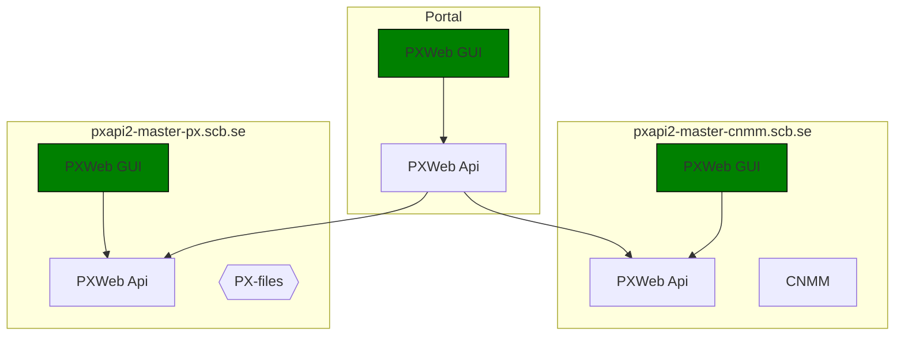
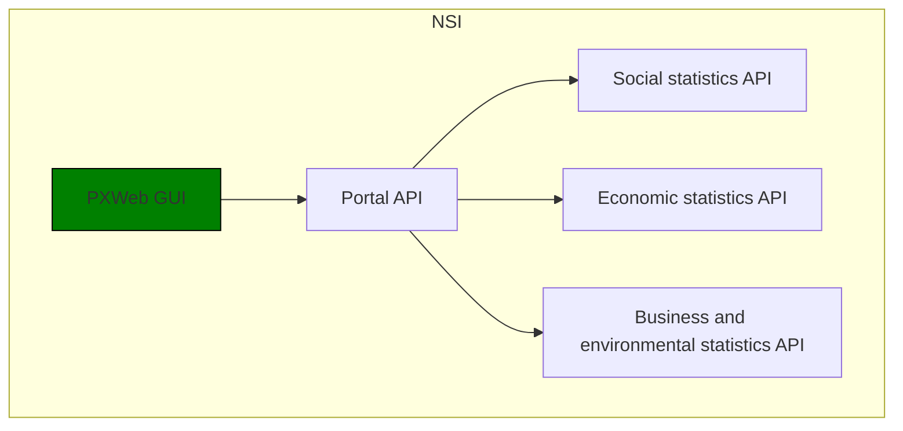

The portal api just aggregates data from other apis.

```mermaid
flowchart TB
   subgraph Portal
   PortalPXWeb[PXWeb GUI]:::guiStyle
   PortalPXWebApi[PXWeb Api]
   end 
   
   subgraph pxapi2-master-cnmm.scb.se
   SSBPXWeb[PXWeb GUI]:::guiStyle
   SSBPXWebApi[PXWeb Api]
   SSBBackend[CNMM]
   end
   
   
   subgraph pxapi2-master-px.scb.se
   SCBPXWeb[PXWeb GUI]:::guiStyle
   SCBPXWebApi[PXWeb Api]
   SCBBackend{{PX-files}}
   end
   
   PortalPXWeb --> PortalPXWebApi
   SSBPXWeb --> SSBPXWebApi
   
   PortalPXWebApi --> SSBPXWebApi
   PortalPXWebApi --> SCBPXWebApi
   SCBPXWeb --> SCBPXWebApi
   classDef guiStyle fill:green,stroke:black   
```

Divide the data into apis by domain 

```mermaid
  flowchart TB
    subgraph NSI
      NSIPXWeb[PXWeb GUI]:::guiStyle
      NSIPortalApi[Portal API]
      NSIPXWeb --> NSIPortalApi
      
      Div1Api[Social statistics API]
      NSIPortalApi --> Div1Api
      
      Div2Api[Economic statistics API]
      NSIPortalApi --> Div2Api
      
      Div3Api[Business and environmental statistics API]
      NSIPortalApi --> Div3Api
    end  
      classDef guiStyle fill:green,stroke:black   
```      
      
       
     
